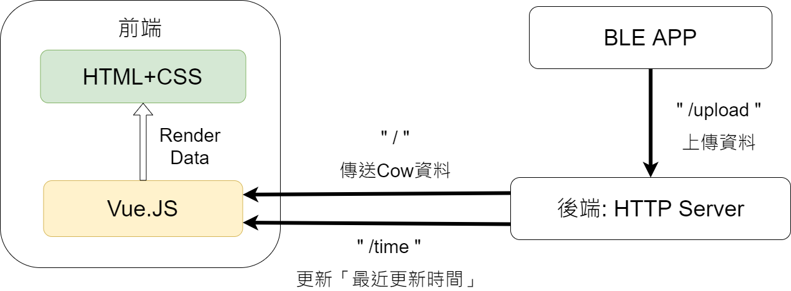

# BLE_Cow_Monitor

這是一個顯示當前牛隻狀態的網頁

------

## How to Use

需要先安裝npm與node.js

### install

```shell
npm install
```

### run website server

```shell
node main.js
```

And the server will run on port 40010.

Preview localhost website: [localhost:40010](localhost:40010)

------

## Technical Detail

### 狀態圖



> BLE_APP相關細結: [peter1719](https://github.com/peter1719)

### 前端 Front-end

- HTML+CSS: W3.CSS
  - 基本的網頁排版美化
  - 響應式網頁
- Javascript:
  - AJAX: AXIOS
    - 傳送與接收POST Request
  - Vue.JS
    - 把AJAX接收到的COW資料渲染到前端
    - 使用setInterval()，使畫面每5秒使用AJAX向Server要求資料並渲染1次

### 後端 Back-end

- Http-server: Express.js
  - 前端Route: 用來與前端的AJAX接口對接
    - "/": 傳送所有的COW資料
    - "/time": 更新最後的更新時間
  - Other Route: 用來從BLE APP接收資料
    - "/upload": 從BLE接收COW的資料

### JSON Data structure from BLE

```json
{
    name: 2,
    Time: '2020-03-01 17-01-23',
    Ambient: 24,
    Object: 36.5,
    Walk: 2,
    Ruminating: 5,
    Eat_time: 1
}
```

1. name: 牛的ID(或是牛的名字)
2. Time: 上次從BLE收資料的時間，會同步更新最新的時間在網頁右上角(每五秒一次)
3. Ambient: 環境溫度
4. Object: 目標溫度，也就是牛隻的溫度
5. Walk: 走路次數
6. Ruminating: 反芻次數
7. Eat_time: 進食次數

> 5, 6, 7 與BLE_APP相關，詳細: [peter1719](https://github.com/peter1719)

